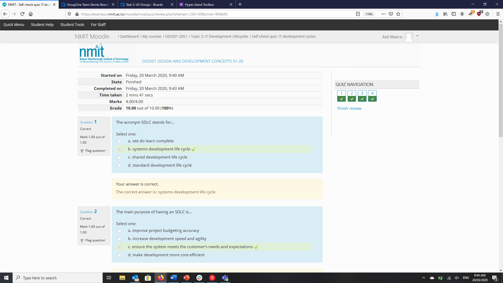

# Activity 3.1-3.3

### Activity 3.1 - Discussion on Importance of SDLC Implementation

As shown in the graphic for activity 3.1, not implementing an SDLC can result in a shoddy, overpriced product that doesn't meet any of the clients needs! This is the main reason that any team or individual with a software development goal should decide on and stick with an SDLC model. Using a model creates expectations, goals and time-frames for which each team or individual must stick with. Although some models allow flexibility they still create clear steps in each stage of development.

### Activity 3.2 - 

### Activity 3.3 -

